# DO2 Linux Network
## Part 1. ipcalc tool
### 1.1. Networks and Masks
#### 1) Network address of 192.167.38.54/13 
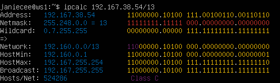
#### 2) Conversion of the mask 255.255.255.0 to prefix and binary, /15 to normal and binary, 11111111.11111111.11111111.11110000 to normal and prefix
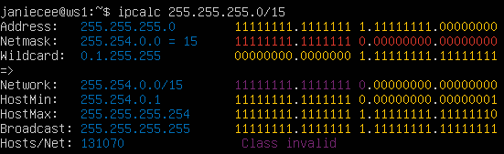
#### 3) Minimum and maximum host in 12.167.38.4 network with masks:
* /8

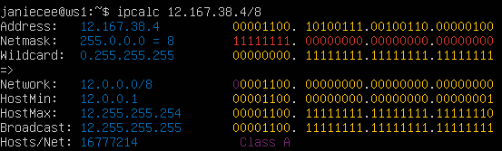

* 11111111.11111111.00000000.00000000


* 255.255.254.0

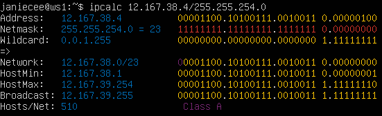

* /4

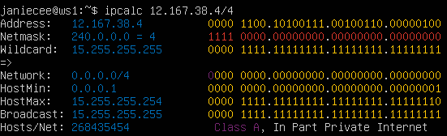

### 1.2. localhost
#### Define and write in the report whether an application running on localhost can be accessed with the following IPs:
IP localhosts on ranges [127.0.0.1 - 127.255.255.254]
|IP|ACCESS|
|--|----|
|194.34.23.100|FALSE|
|127.0.0.2|TRUE|
|127.1.0.1|TRUE|
|128.0.0.1|FALSE|

### 1.3. Network ranges and segments
#### Define and write in a report:
#### 1) which of the listed IPs can be used as public and which only as private: 10.0.0.45, 134.43.0.2, 192.168.4.2, 172.20.250.4, 172.0.2.1, 192.172.0.1, 172.68.0.2, 172.16.255.255, 10.10.10.10, 192.169.168.1
|Private range|10.0.0.0 – 10.255.255.255|172.16.0.0 – 172.31.255.255|192.168.0.0 – 192.168.255.255|
|-|-|-|-|

[Difference private and public IP](https://www.geeksforgeeks.org/difference-between-private-and-public-ip-addresses/)
|PUBLIC|PRIVATE|
|------|-------|
|134.43.0.2|10.0.0.45|
|172.0.2.1|192.168.4.2|
|192.172.0.1|172.20.250.4|
|172.68.0.2|172.16.255.255|
|10.10.10.10|192.169.168.1|

#### 2) which of the listed gateway IP addresses are possible for 10.10.0.0/18 network: 10.0.0.1, 10.10.0.2, 10.10.10.10, 10.10.100.1, 10.10.1.255
Access IP range: 10.10.0.1 - 10.10.63.254
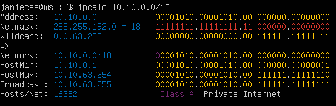

|IP|ACCESS|
|------|-------|
|10.0.0.1|FALSE|
|10.10.0.2|TRUE|
|10.10.10.10|TRUE|
|10.10.100.1|FALSE|
|10.10.1.255|TRUE|

## Part 2. Static routing between two machines
#### Start two virtual machines (hereafter -- ws1 and ws2 View existing network interfaces with the ip a command
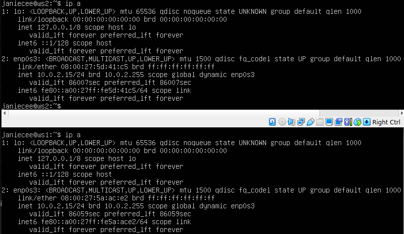

* enp0s3 name interface for ws1 and ws2

#### Describe the network interface corresponding to the internal network on both machines and set the following addresses and masks: ws1 - 192.168.100.10, mask */16 *, ws2 - 172.24.116.8, mask /12

`sudo nano etc/netplan/00-installer-config.yaml`
* ws1:

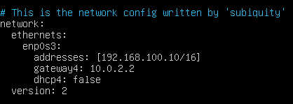

* ws2:

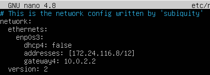

`sudo netplan apply`

* ws1:

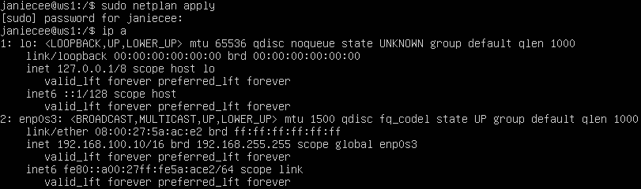

* ws2:

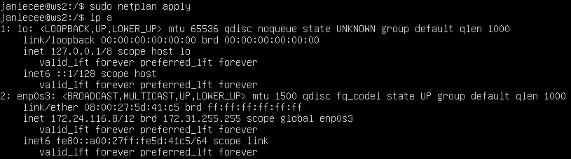

### 2.1. Adding a static route manually

* ws1:

`sudo ip r add 172.24.116.8 dev enp0s3`
`sudo ping 192.168.100.10`

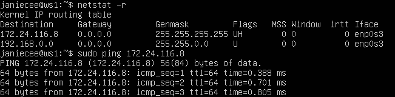

* ws2:

`sudo ip r add 192.168.100.10 dev enp0s3`
`sudo ping 172.24.116.8`

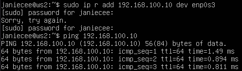

### 2.2. Adding a static route with saving

[ROUTES](https://linuxconfig.org/how-to-add-static-route-with-netplan-on-ubuntu-20-04-focal-fossa-linux)

`sudo nano etc/netplan/00-installer-config.yaml`

* ws1:

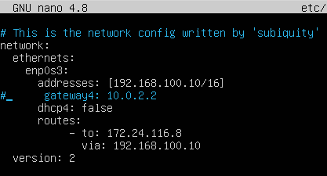

* ws2:

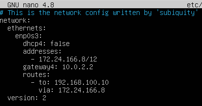

* ws1 :
`sudo netplan apply`
`ping 172.24.116.8`

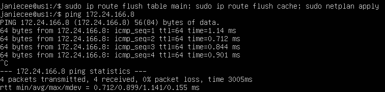

* ws2 : `sudo ip route flush table main` `sudo ip route flush cache` `sudo netplan apply` `ping 192.168.100.10` (`ip route` commands for apply settings without restart network service)

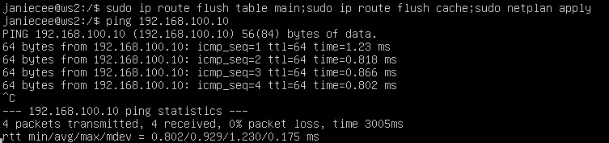

## Part 3. iperf3 utility

### 3.1. Connection speed

8 Mbps = 1 MB/s, 100 MB/s = 819200 Kbps, 1 Gbps = 1024 Mbps

### 3.2. iperf3 utility

* ws1: `sudo iperf3 -c 172.24.166.8 -p 5201`

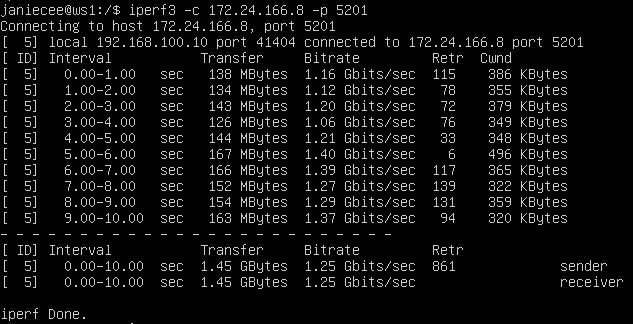

* ws2: `sudo iperf3 -s`

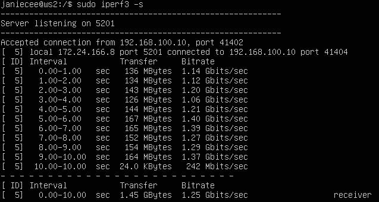

* ws2: `sudo iperf3 -c 192.168.100.10 -f M`

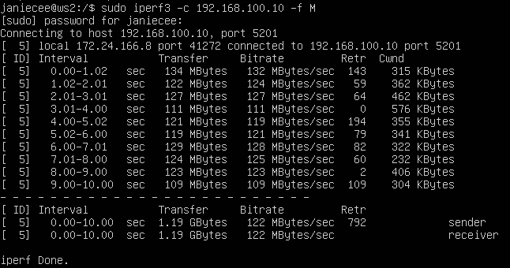

* ws1: `sudo iperf3 -s`

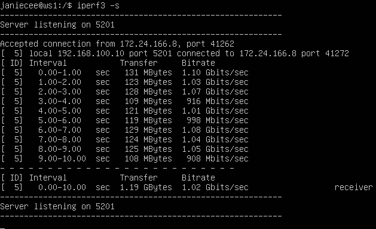

## Part 4. Network firewall

`sudo ufw disable` (if firewall active)

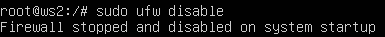


### 4.1. iptables utility
Create a /etc/firewall.sh file simulating the firewall on ws1 and ws2:
##### 3) open access on machines for port 22 (ssh) and port 80 (http)
```shell
#!/bin/sh

# Deleting all the rules in the "filter" table (default).
iptables -F
iptables –X
# open access on machines for port 22 (ssh)
iptables -A INPUT -p tcp --dport 22 -j ACCEPT
iptables -A OUTPUT -p tcp --dport 22 -j ACCEPT
# and port 80 (http)
iptables -A INPUT -p tcp --dport 80 -j ACCEPT
iptables -A OUTPUT -p tcp --dport 80 -j ACCEPT
```
ws1:
```shell
# iptables -{A|I} {INPUT|OUTPUT} -p icmp --icmp-type {echo-reply|echo-request} -j {ACCEPT|REJECT|DROP}
# on ws1 apply a strategy where a deny rule is written at the beginning
iptables -I OUTPUT -p icmp --icmp-type echo-reply -j DROP
# and an allow rule is written at the end (this applies to points 4 and 5)
iptables -A OUTPUT -p icmp --icmp-type echo-reply -j ACCEPT
/sbin/iptables-save
```
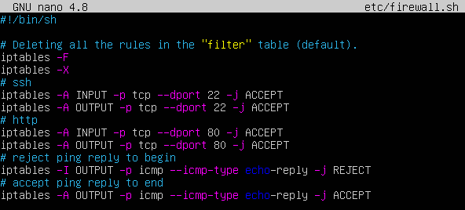


ws2:
```shell
# iptables -{A|I} {INPUT|OUTPUT} -p icmp --icmp-type {echo-reply|echo-request} -j {ACCEPT|REJECT|DROP}
# on ws2 apply a strategy where an allow rule is written at the beginning 
iptables -I OUTPUT -p icmp --icmp-type echo-reply -j ACCEPT
# and a deny rule is written at the end (this applies to points 4 and 5)
iptables -A OUTPUT -p icmp --icmp-type echo-reply -j DROP
/sbin/iptables-save
```
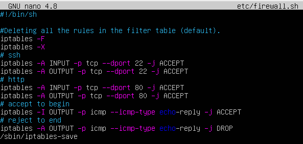

##### Run the files on both machines with `chmod +x /etc/firewall.sh` and `/etc/firewall.sh` commands.
##### ws1:
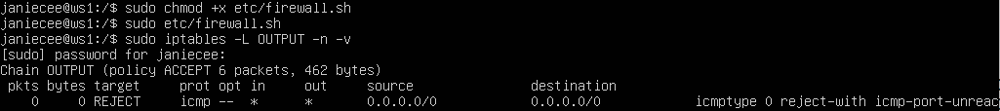
##### ws2:
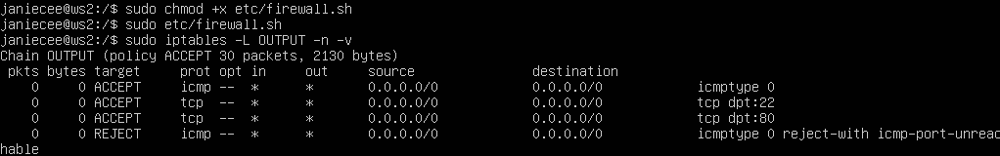

#### If a rule does not match the packet, the packet is passed to the next rule. If a rule does match the packet, the rule takes the action indicated by the target/verdict, which may result in the packet being allowed to continue along the chain or it may not. On ws1 first rule `DROP` break the chain also ws2 first rule `ACCEPT` break the chain but ping paсkets go to ws2.

### SSH

#### Work in VM from VirtualBox very difficult and now we connect second adapter (NAT) and connect VM to host machine and internet.

1) Enable second network adapter NAT:

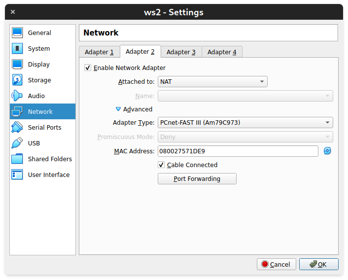

2) Start VM:

`ip a`

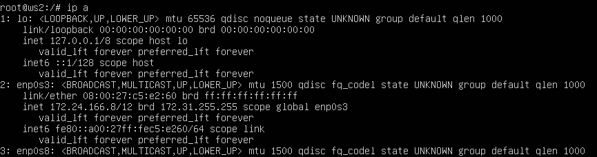


##### `enp0s8` interface second adapter but now is not working. Go to netplan setting and set parameters for this interface:

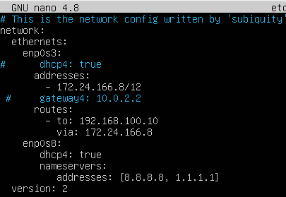

##### Apply command: `sudo netplan apply`

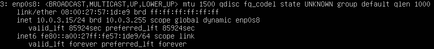

##### Now we see ip address `enp0s8`. But we can't ssh connect directly to this ip. Solution is forwarding port `22` on ip `10.0.3.15` to port `2223` on `127.0.0.1`

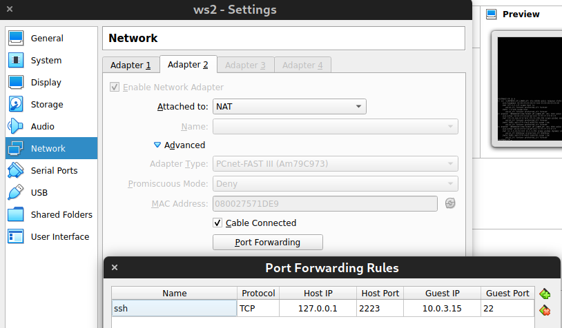

`sudo reboot` - executing command 

##### Try to connect ws2 from ssh `sudo ssh -p 2223 janiecee@127.0.0.1`

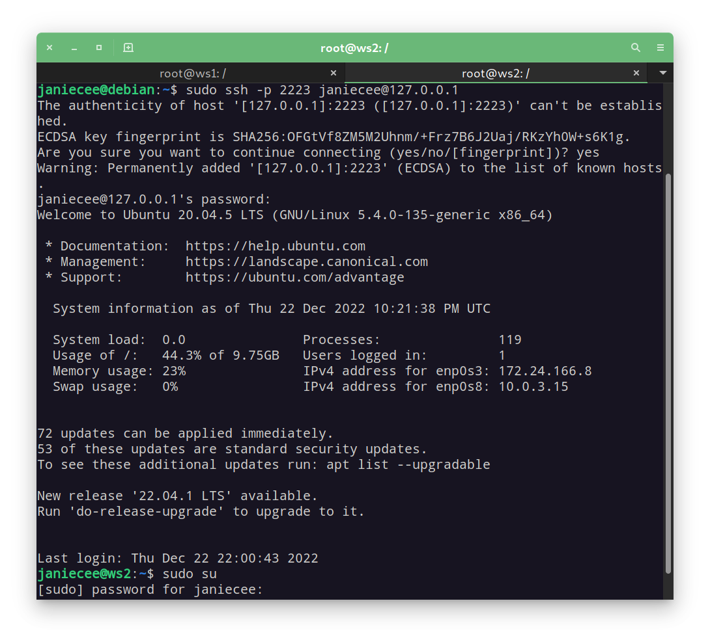

##### Ready! Lat's go to part 4.2

#### 4.2. **nmap** utility

`apt install nmap`
##### Use **ping** command to find a machine which is not pinged, then use **nmap** utility to show that the machine host is up
*Check: nmap output should say: `Host is up`*.

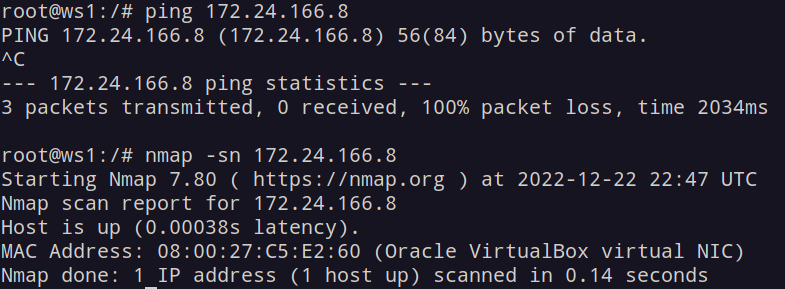


- Add screenshots with the call and output of the **ping** and **nmap** commands to the report.

##### Save dumps of the virtual machine images
**p.s. Do not upload dumps to git under any circumstances!**